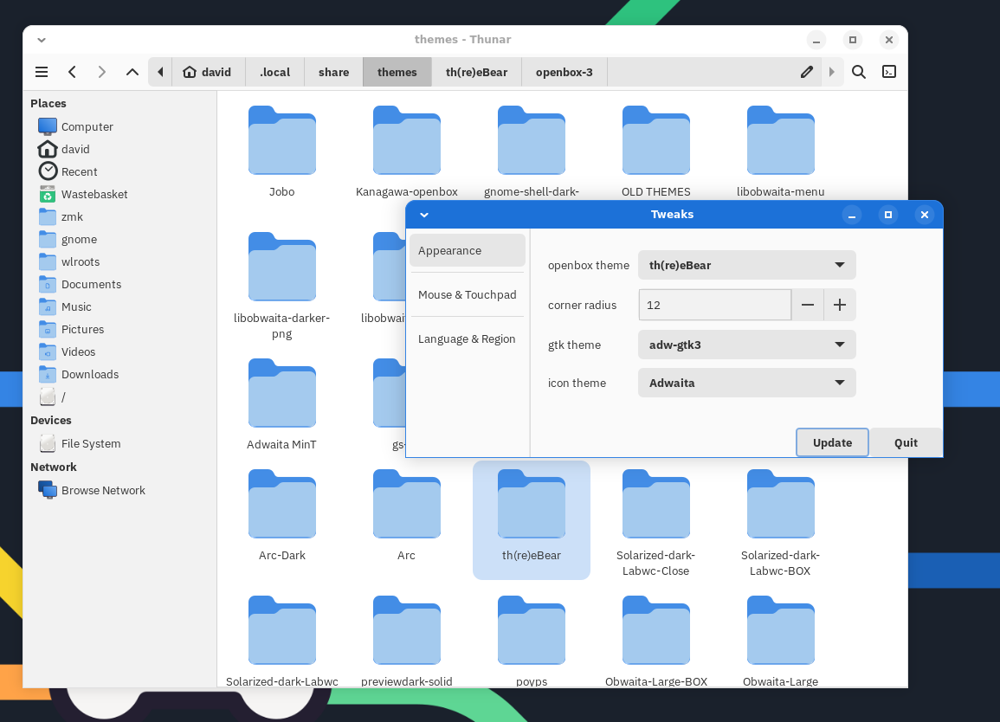

# Some Labwc themes of a Gnome flavour 

A updated version of the Adwaita themes has moved here and will/should be activly maintained... https://github.com/davidphilipbarr/labwc-adwaita

## Adwaita

## Adwaita-dark

## Adwaita-lignite

## Adwaita-labwc-dark (only use xbms)

## Adwaita-labwc (only use xbms)

## Solarized-dark (only use xbms)

## Compiz

## arc-dark

## th(re)eBear

